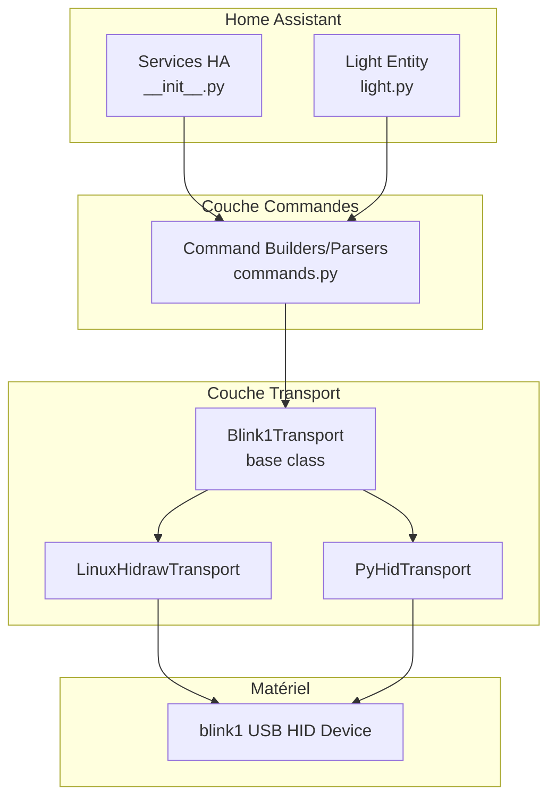
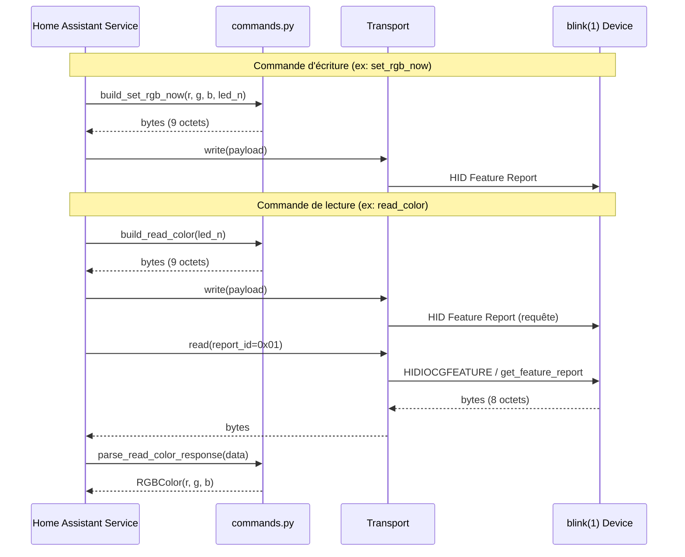

# Design Document: blink1-tool-commands

## Overview

Ce document décrit la conception technique pour l'extension de l'intégration Home Assistant blink(1) USB afin de supporter l'ensemble des commandes HID du protocole blink(1). L'implémentation étend la couche Transport existante avec des capacités de lecture, ajoute un module de commandes protocolaires, et expose les fonctionnalités via des services Home Assistant.

### Objectifs principaux

1. Ajouter le support de lecture HID au Transport (ioctl HIDIOCGFEATURE sur Linux, `get_feature_report` via PyHID)
2. Implémenter toutes les commandes du protocole blink(1) mk2+ (set RGB, read color, firmware version, pattern lines, play loop, server tickle)
3. Exposer ces commandes comme services Home Assistant avec validation des paramètres
4. Implémenter le mécanisme watchdog (server tickle) avec une tâche keepalive asynchrone
5. Supporter le parsing/formatage de patterns sous forme de chaînes lisibles

### Décisions techniques clés

- **Pas de dépendance externe supplémentaire** : Le protocole HID est implémenté directement sur les transports existants
- **Approche synchrone pour le HID** : Les opérations HID sont exécutées dans l'executor via `hass.async_add_executor_job` (pattern existant)
- **Module `commands.py` séparé** : Les builders/parsers de commandes sont dans un module pur (sans I/O) pour faciliter les tests
- **Dataclass pour les résultats** : Les réponses structurées utilisent des dataclasses frozen pour l'immuabilité

## Architecture



### Flux de données



## Components and Interfaces

### 1. Module `commands.py` — Builders et Parsers de commandes

Module pur (sans I/O) contenant toute la logique de construction et de parsing des feature reports HID blink(1).

```python
"""Builders et parsers pour le protocole HID blink(1)."""
from __future__ import annotations
from dataclasses import dataclass

# --- Dataclasses de résultat ---

@dataclass(frozen=True, slots=True)
class RGBColor:
    """Couleur RGB lue depuis le dispositif."""
    r: int  # 0-255
    g: int  # 0-255
    b: int  # 0-255

@dataclass(frozen=True, slots=True)
class PatternLine:
    """Une ligne de pattern lue depuis le dispositif."""
    r: int       # 0-255
    g: int       # 0-255
    b: int       # 0-255
    fade_ms: int # 0-655350, multiple de 10

@dataclass(frozen=True, slots=True)
class PlayState:
    """État de lecture des patterns."""
    playing: bool
    play_start: int   # 0-31
    play_end: int     # 0-31
    play_count: int   # 0-255
    play_pos: int     # 0-31

# --- Constantes du protocole ---
REPORT_ID = 0x01
CMD_FADE_TO_RGB = 0x63       # 'c'
CMD_SET_RGB_NOW = 0x6E       # 'n'
CMD_READ_COLOR = 0x72        # 'r'
CMD_GET_VERSION = 0x76       # 'v'
CMD_SET_PATTERN_LINE = 0x50  # 'P'
CMD_READ_PATTERN_LINE = 0x52 # 'R'
CMD_SAVE_PATTERNS = 0x57     # 'W'
CMD_PLAY_LOOP = 0x70         # 'p'
CMD_PLAY_STATE = 0x53        # 'S'
CMD_SERVER_TICKLE = 0x44     # 'D'

MAX_PATTERN_POS = 31
MAX_LED_INDEX = 2
MAX_FADE_MS = 655350
MAX_RGB = 255

# --- Fonctions de validation ---
def validate_rgb(r: int, g: int, b: int) -> None: ...
def validate_led_index(led_n: int) -> None: ...
def validate_position(pos: int) -> None: ...
def validate_fade_ms(fade_ms: int) -> None: ...

# --- Builders de commandes (écriture) ---
def build_set_rgb_now(r: int, g: int, b: int, led_n: int = 0) -> bytes: ...
def build_fade_to_rgb(r: int, g: int, b: int, fade_ms: int = 100, led_n: int = 0) -> bytes: ...
def build_read_color_request(led_n: int = 0) -> bytes: ...
def build_get_version_request() -> bytes: ...
def build_set_pattern_line(r: int, g: int, b: int, fade_ms: int, pos: int) -> bytes: ...
def build_read_pattern_line_request(pos: int) -> bytes: ...
def build_save_patterns() -> bytes: ...
def build_play_loop(start: int, end: int, count: int = 0) -> bytes: ...
def build_stop_play() -> bytes: ...
def build_play_state_request() -> bytes: ...
def build_server_tickle_enable(timeout_ms: int, start: int, end: int) -> bytes: ...
def build_server_tickle_disable() -> bytes: ...

# --- Parsers de réponses (lecture) ---
def parse_read_color_response(data: bytes) -> RGBColor: ...
def parse_get_version_response(data: bytes) -> str: ...
def parse_read_pattern_line_response(data: bytes) -> PatternLine: ...
def parse_play_state_response(data: bytes) -> PlayState: ...

# --- Parsing/formatage de chaînes de patterns ---
def parse_pattern_string(pattern_str: str) -> list[PatternLine]: ...
def format_pattern_lines(lines: list[PatternLine]) -> str: ...
```

### 2. Extension du Transport — Support de lecture

```python
# Ajouts à transport.py

class Blink1Transport:
    """Interface minimale pour la communication blink(1)."""

    def write(self, payload: bytes) -> None:
        """Écrire un feature report HID."""

    def read(self, report_id: int = 0x01) -> bytes:
        """Lire un feature report HID depuis le dispositif.

        Returns:
            bytes: Les octets de la réponse (8 octets minimum).

        Raises:
            TimeoutError: Si pas de réponse dans le délai d'1 seconde.
            OSError: Si la réponse est tronquée ou invalide.
        """

    def close(self) -> None:
        """Fermer les ressources."""


class LinuxHidrawTransport(Blink1Transport):
    def read(self, report_id: int = 0x01) -> bytes:
        """Lecture via ioctl HIDIOCGFEATURE sur le fd hidraw."""
        # Prépare un buffer de 9 octets avec report_id en byte 0
        # Appelle fcntl.ioctl(fd, HIDIOCGFEATURE(9), buffer)
        # Retourne les octets lus


class PyHidTransport(Blink1Transport):
    def read(self, report_id: int = 0x01) -> bytes:
        """Lecture via get_feature_report du package hid."""
        # Appelle device.get_feature_report(report_id, 9)
        # Retourne les octets lus
```

### 3. Services Home Assistant — Extension de `__init__.py`

```python
# Ajouts à __init__.py

async def async_setup_entry(hass: HomeAssistant, entry: ConfigEntry) -> bool:
    """Set up + enregistrement des services."""
    # ... setup existant ...
    # Enregistrement des services blink1
    _register_services(hass)
    return True

def _register_services(hass: HomeAssistant) -> None:
    """Enregistre tous les services blink1_status."""
    # Services de pattern
    hass.services.async_register(DOMAIN, "set_pattern_line", _handle_set_pattern_line, schema=...)
    hass.services.async_register(DOMAIN, "get_pattern_line", _handle_get_pattern_line, schema=...)
    hass.services.async_register(DOMAIN, "save_pattern", _handle_save_pattern, schema=...)
    hass.services.async_register(DOMAIN, "clear_pattern", _handle_clear_pattern, schema=...)
    hass.services.async_register(DOMAIN, "write_pattern", _handle_write_pattern, schema=...)
    hass.services.async_register(DOMAIN, "read_pattern", _handle_read_pattern, schema=...)
    # Services de play loop
    hass.services.async_register(DOMAIN, "play_pattern", _handle_play_pattern, schema=...)
    hass.services.async_register(DOMAIN, "stop_pattern", _handle_stop_pattern, schema=...)
    hass.services.async_register(DOMAIN, "play_state", _handle_play_state, schema=...)
    # Services d'effets
    hass.services.async_register(DOMAIN, "blink", _handle_blink, schema=...)
    # Services de watchdog
    hass.services.async_register(DOMAIN, "enable_server_tickle", _handle_enable_server_tickle, schema=...)
    hass.services.async_register(DOMAIN, "disable_server_tickle", _handle_disable_server_tickle, schema=...)
    # Service d'état
    hass.services.async_register(DOMAIN, "get_device_state", _handle_get_device_state, schema=...)
```

### 4. Gestion du Server Tickle — Tâche keepalive asynchrone

```python
# Dans __init__.py ou un module dédié

class ServerTickleManager:
    """Gère la tâche keepalive du server tickle."""

    def __init__(self, hass: HomeAssistant, transport: Blink1Transport) -> None:
        self._hass = hass
        self._transport = transport
        self._task: asyncio.Task | None = None
        self._cancel_event: asyncio.Event = asyncio.Event()

    async def start(self, timeout_ms: int, start: int, end: int) -> None:
        """Démarre le keepalive. Annule toute tâche existante."""
        await self.stop()
        payload = build_server_tickle_enable(timeout_ms, start, end)
        interval = timeout_ms / 2000  # 50% du timeout, en secondes
        self._cancel_event.clear()
        self._task = self._hass.async_create_task(
            self._keepalive_loop(payload, interval)
        )

    async def stop(self) -> None:
        """Arrête le keepalive et désactive le server tickle."""
        if self._task is not None:
            self._cancel_event.set()
            self._task.cancel()
            self._task = None
        payload = build_server_tickle_disable()
        await self._hass.async_add_executor_job(self._transport.write, payload)

    async def _keepalive_loop(self, payload: bytes, interval: float) -> None:
        """Boucle d'envoi périodique du keepalive."""
        try:
            while not self._cancel_event.is_set():
                await self._hass.async_add_executor_job(self._transport.write, payload)
                await asyncio.sleep(interval)
        except asyncio.CancelledError:
            pass
```

### 5. Gestion du Blink (clignotement) — Effet temporaire

```python
class BlinkEffectManager:
    """Gère l'effet de clignotement avec sauvegarde/restauration des patterns."""

    def __init__(self, hass: HomeAssistant, transport: Blink1Transport) -> None:
        self._hass = hass
        self._transport = transport
        self._active_task: asyncio.Task | None = None

    async def start_blink(self, r: int, g: int, b: int, count: int, fade_ms: int, led_n: int) -> None:
        """Démarre un clignotement. Annule tout clignotement en cours."""
        if self._active_task is not None:
            self._active_task.cancel()
            # Attendre la restauration avant de relancer

        self._active_task = self._hass.async_create_task(
            self._blink_sequence(r, g, b, count, fade_ms, led_n)
        )

    async def _blink_sequence(self, r, g, b, count, fade_ms, led_n) -> None:
        """Sauvegarde patterns 0-1, écrit le blink, lance play, restaure."""
        # 1. Sauvegarder les pattern lines aux positions 0 et 1
        # 2. Écrire la couleur à la position 0, noir à la position 1
        # 3. Démarrer le play loop sur 0-2 avec count
        # 4. Attendre la fin (count * 2 * fade_ms)
        # 5. Restaurer les pattern lines originales
```

## Data Models

### Feature Report HID (9 octets)

| Byte | Champ | Description |
|------|-------|-------------|
| 0 | report_id | Toujours 0x01 |
| 1 | command | Caractère ASCII de la commande |
| 2 | arg0 | Premier argument (souvent R ou flags) |
| 3 | arg1 | Deuxième argument (souvent G) |
| 4 | arg2 | Troisième argument (souvent B) |
| 5 | arg3 | Quatrième argument (souvent th) |
| 6 | arg4 | Cinquième argument (souvent tl) |
| 7 | arg5 | Sixième argument (souvent led_n ou pos) |
| 8 | padding | Toujours 0x00 (padding pour l'envoi) |

Note : Le protocole blink(1) définit le paquet comme 8 octets (report_id + 7 octets de données). Le 9ème octet est un padding ajouté pour certains systèmes HID.

### Encodage du temps de fondu (fade time)

```
fade_units = fade_ms // 10
th = (fade_units >> 8) & 0xFF   # octet haut
tl = fade_units & 0xFF          # octet bas
```

Plage : 0 à 65535 unités → 0 à 655350 ms

### Schémas de validation des services (voluptuous)

```python
import voluptuous as vol

SCHEMA_SET_PATTERN_LINE = vol.Schema({
    vol.Required("position"): vol.All(int, vol.Range(min=0, max=31)),
    vol.Required("red"): vol.All(int, vol.Range(min=0, max=255)),
    vol.Required("green"): vol.All(int, vol.Range(min=0, max=255)),
    vol.Required("blue"): vol.All(int, vol.Range(min=0, max=255)),
    vol.Required("fade_ms"): vol.All(int, vol.Range(min=0, max=655350)),
    vol.Optional("led", default=0): vol.All(int, vol.Range(min=0, max=2)),
})

SCHEMA_GET_PATTERN_LINE = vol.Schema({
    vol.Required("position"): vol.All(int, vol.Range(min=0, max=31)),
})

SCHEMA_WRITE_PATTERN = vol.Schema({
    vol.Required("pattern"): str,
})

SCHEMA_READ_PATTERN = vol.Schema({
    vol.Required("start"): vol.All(int, vol.Range(min=0, max=31)),
    vol.Required("end"): vol.All(int, vol.Range(min=0, max=31)),
})

SCHEMA_PLAY_PATTERN = vol.Schema({
    vol.Required("start"): vol.All(int, vol.Range(min=0, max=31)),
    vol.Required("end"): vol.All(int, vol.Range(min=0, max=31)),
    vol.Optional("count", default=0): vol.All(int, vol.Range(min=0, max=255)),
})

SCHEMA_BLINK = vol.Schema({
    vol.Required("red"): vol.All(int, vol.Range(min=0, max=255)),
    vol.Required("green"): vol.All(int, vol.Range(min=0, max=255)),
    vol.Required("blue"): vol.All(int, vol.Range(min=0, max=255)),
    vol.Optional("count", default=3): vol.All(int, vol.Range(min=1, max=255)),
    vol.Optional("fade_ms", default=300): vol.All(int, vol.Range(min=0, max=655350)),
    vol.Optional("led", default=0): vol.All(int, vol.Range(min=0, max=2)),
})

SCHEMA_ENABLE_SERVER_TICKLE = vol.Schema({
    vol.Required("timeout_ms"): vol.All(int, vol.Range(min=100, max=655350)),
    vol.Required("start"): vol.All(int, vol.Range(min=0, max=31)),
    vol.Required("end"): vol.All(int, vol.Range(min=0, max=31)),
})
```

### Format de chaîne de pattern

```
Format: "R,G,B,fade_ms;R,G,B,fade_ms;..."
Exemple: "255,0,0,500;0,255,0,500;0,0,255,500"
```

- Séparateur de segments : `;` (point-virgule)
- Séparateur de composantes : `,` (virgule)
- Maximum 32 segments
- Chaque segment : 4 valeurs entières (R, G, B, fade_ms)
- Pas d'espaces superflus dans le format canonique

### Stockage dans `hass.data`

```python
# Structure dans hass.data[DOMAIN][entry_id]
hass.data[DOMAIN][entry_id] = {
    "transport": Blink1Transport,           # Instance du transport HID
    "tickle_manager": ServerTickleManager,  # Gestionnaire watchdog
    "blink_manager": BlinkEffectManager,    # Gestionnaire clignotement
}
```


## Correctness Properties

*Une propriété est une caractéristique ou un comportement qui doit rester vrai pour toutes les exécutions valides d'un système — essentiellement, une déclaration formelle de ce que le système doit faire. Les propriétés servent de pont entre les spécifications lisibles par l'humain et les garanties de correction vérifiables par machine.*

### Property 1: Aller-retour des chaînes de pattern (Round-trip)

*Pour toute* chaîne de pattern valide au format "R,G,B,fade_ms;..." (1 à 32 segments, R/G/B dans 0-255, fade_ms dans 0-655350 par incréments de 10), parser la chaîne puis formater le résultat SHALL produire une chaîne identique à l'originale.

**Validates: Requirements 18.3**

### Property 2: Aller-retour des Pattern Lines (build/parse)

*Pour toute* PatternLine valide (r, g, b dans 0-255, fade_ms dans 0-655350 multiple de 10, pos dans 0-31), construire le Feature_Report via `build_set_pattern_line` puis parser les octets de données (bytes 2-7) via `parse_read_pattern_line_response` SHALL retourner les mêmes valeurs r, g, b et fade_ms.

**Validates: Requirements 5.1, 6.2**

### Property 3: Structure de la commande Set RGB Now

*Pour toute* combinaison valide de (r, g, b) dans 0-255 et led_n dans 0-2, `build_set_rgb_now(r, g, b, led_n)` SHALL produire exactement 9 octets où byte[0]=0x01, byte[1]=0x6E, byte[2]=r, byte[3]=g, byte[4]=b, byte[5]=0x00, byte[6]=0x00, byte[7]=led_n, byte[8]=0x00.

**Validates: Requirements 1.1, 4.1**

### Property 4: Structure de la commande Play Loop

*Pour tout* start dans 0-30, end dans (start+1)-31, et count dans 0-255, `build_play_loop(start, end, count)` SHALL produire exactement 9 octets où byte[0]=0x01, byte[1]=0x70, byte[2]=0x01, byte[3]=start, byte[4]=end, byte[5]=count, bytes[6-8]=0x00.

**Validates: Requirements 9.1**

### Property 5: Structure et encodage de la commande Server Tickle Enable

*Pour tout* timeout_ms valide (10-655350), start dans 0-30 et end dans (start+1)-31, `build_server_tickle_enable(timeout_ms, start, end)` SHALL produire 9 octets où byte[0]=0x01, byte[1]=0x44, byte[2]=0x01, bytes[3-4] encodent (timeout_ms//10) en big-endian, byte[5]=0x00, byte[6]=start, byte[7]=end, byte[8]=0x00.

**Validates: Requirements 11.1**

### Property 6: Rejet des valeurs RGB hors bornes

*Pour tout* triplet (r, g, b) où au moins une valeur est hors de l'intervalle 0-255 (entier négatif ou supérieur à 255), toute fonction de construction de commande acceptant des composantes RGB SHALL lever une ValueError sans produire de Feature_Report.

**Validates: Requirements 1.3, 5.4**

### Property 7: Rejet des LED_Index invalides

*Pour tout* entier led_n hors de l'intervalle 0-2, toute fonction de construction de commande acceptant un LED_Index SHALL lever une ValueError.

**Validates: Requirements 1.4, 4.3**

### Property 8: Rejet des positions hors bornes

*Pour tout* entier pos hors de l'intervalle 0-31, toute fonction de construction de commande acceptant une position SHALL lever une ValueError.

**Validates: Requirements 5.2, 6.3, 9.4**

### Property 9: Rejet des fade_ms hors bornes

*Pour tout* entier fade_ms négatif ou supérieur à 655350, toute fonction de construction de commande acceptant un fade_ms SHALL lever une ValueError.

**Validates: Requirements 5.3**

### Property 10: Rejet quand start >= end

*Pour toute* paire (start, end) dans 0-31 où start >= end, les fonctions `build_play_loop` et `build_server_tickle_enable` SHALL lever une ValueError sans produire de Feature_Report.

**Validates: Requirements 9.3, 11.5**

### Property 11: Rejet des timeout hors bornes pour Server Tickle

*Pour tout* entier timeout_ms inférieur à 10 ou supérieur à 655350, `build_server_tickle_enable` SHALL lever une ValueError.

**Validates: Requirements 11.4**

### Property 12: Parsing correct de la réponse de couleur

*Pour tout* buffer de 8 octets avec byte[1]=0x72 ('r') et bytes[2-4] représentant des valeurs RGB (0-255), `parse_read_color_response` SHALL retourner un RGBColor dont r=byte[2], g=byte[3], b=byte[4].

**Validates: Requirements 2.2**

### Property 13: Parsing correct de la version firmware

*Pour tout* buffer de 8 octets avec byte[1]=0x76 ('v') et bytes[3-4] représentant major et minor (0-255), `parse_get_version_response` SHALL retourner la chaîne "{major}.{minor}" en notation décimale.

**Validates: Requirements 3.1**

### Property 14: Parsing correct du Play State

*Pour tout* buffer de 8 octets avec byte[1]=0x53 ('S'), byte[2] dans {0,1}, bytes[3-6] dans 0-31/0-255, `parse_play_state_response` SHALL retourner un PlayState avec playing=(byte[2]==1), play_start=byte[3], play_end=byte[4], play_count=byte[5], play_pos=byte[6].

**Validates: Requirements 10.2**

### Property 15: Rejet des réponses sans marqueur de version

*Pour tout* buffer de 8 octets dont byte[1] != 0x76, `parse_get_version_response` SHALL lever une OSError.

**Validates: Requirements 3.3**

### Property 16: Rejet des réponses tronquées

*Pour tout* buffer de longueur 0 à 7 octets, la méthode `read` du Transport SHALL lever une OSError indiquant une réponse tronquée.

**Validates: Requirements 17.5**

### Property 17: Rejet des chaînes de pattern malformées

*Pour toute* chaîne contenant au moins un segment avec un nombre de composantes différent de 4, ou des valeurs non-numériques, ou des valeurs RGB hors de 0-255, ou un fade_ms hors de 0-655350, `parse_pattern_string` SHALL lever une ValueError indiquant la position du segment invalide.

**Validates: Requirements 18.5**

## Error Handling

### Stratégie d'erreurs par couche

| Couche | Type d'erreur | Action |
|--------|---------------|--------|
| `commands.py` (validation) | `ValueError` | Levée immédiate avec message descriptif incluant la valeur reçue et les bornes valides |
| `commands.py` (parsing) | `OSError` | Levée si le marqueur de commande dans la réponse est invalide |
| `transport.py` (I/O) | `OSError` | Propagation des erreurs HID sous-jacentes |
| `transport.py` (timeout) | `TimeoutError` | Levée après 1 seconde sans réponse |
| `__init__.py` (services) | `HomeAssistantError` | Conversion des erreurs transport en erreurs de service HA |

### Gestion des erreurs dans les services HA

```python
from homeassistant.exceptions import HomeAssistantError

async def _handle_service(hass, call, operation):
    """Wrapper générique pour les handlers de service."""
    try:
        return await operation(hass, call)
    except ValueError as err:
        # Erreurs de validation des paramètres
        raise HomeAssistantError(f"Paramètre invalide: {err}") from err
    except (OSError, TimeoutError) as err:
        # Erreurs de communication avec le dispositif
        raise HomeAssistantError(f"Erreur de communication blink(1): {err}") from err
```

### Cas spéciaux

1. **Effacement interrompu** : Si une erreur survient pendant `clear_pattern` à la position N, l'exception OSError inclut le numéro de position pour permettre le diagnostic.

2. **Server Tickle cleanup** : Lors du `async_unload_entry`, le `ServerTickleManager.stop()` est appelé dans un bloc try/except pour garantir la fermeture même si le dispositif est déconnecté.

3. **Blink interrompu** : Si un clignotement est annulé par un nouveau, la restauration des pattern lines est tentée. En cas d'échec de restauration, un warning est loggé mais l'erreur n'est pas propagée.

4. **Timeout configurable** : Le timeout de lecture de 1 seconde est une constante (`READ_TIMEOUT_S = 1.0`) dans le module transport pour faciliter les tests et le tuning futur.

## Testing Strategy

### Property-Based Testing (PBT)

Ce feature est hautement adapté au PBT car il contient de nombreuses fonctions pures (builders, parsers, validators) avec des domaines d'entrée bien définis et des propriétés universelles vérifiables.

**Bibliothèque** : `hypothesis` (standard Python pour PBT)

**Configuration** :
- Minimum 100 itérations par property test
- Chaque test est tagué avec la propriété qu'il valide

**Tag format** : `Feature: blink1-tool-commands, Property {number}: {property_text}`

### Tests unitaires (example-based)

Les tests unitaires couvrent :
- Valeurs par défaut (LED_Index=0 quand omis)
- Commandes à sortie fixe (`build_save_patterns`, `build_stop_play`, `build_play_state_request`)
- Effacement complet (vérifie exactement 32 appels write)
- Erreurs de communication mockées
- Timeout mockés

### Tests d'intégration

Les tests d'intégration couvrent :
- Enregistrement et appel des services HA avec un transport mocké
- Cycle de vie du ServerTickleManager (start/stop/cancel)
- Cycle de vie du BlinkEffectManager (sauvegarde/restauration des patterns)
- Comportement lors du unload de l'intégration avec tickle actif
- Validation des schémas voluptuous (rejet des paramètres hors bornes)

### Structure des fichiers de tests

```
tests/
├── test_commands.py          # Tests PBT et unitaires du module commands.py
├── test_transport_read.py    # Tests du support de lecture dans le transport
├── test_services.py          # Tests d'intégration des services HA
├── test_server_tickle.py     # Tests du ServerTickleManager
└── test_blink_effect.py      # Tests du BlinkEffectManager
```

### Approche de test dual

- **Property tests** (`test_commands.py`) : Vérifient les 17 propriétés de correction. Chaque property est un test unique avec `@given(...)` de Hypothesis exécuté 100+ fois.
- **Unit tests** : Vérifient les cas concrets, les valeurs par défaut, et les edge cases identifiés.
- **Integration tests** : Vérifient le câblage entre services HA et transport avec des mocks.
